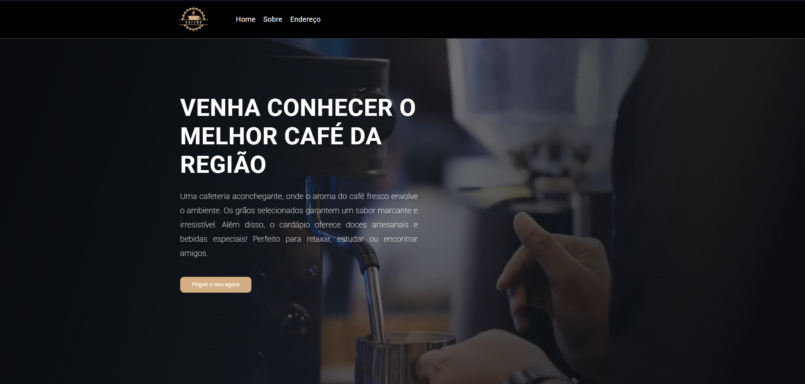

# Site da Cafeteria - Angular 17

Este projeto é um site moderno e responsivo para uma cafeteria, desenvolvido em Angular 17.
O site apresenta uma interface atraente com vídeo de fundo, seções informativas, 
modal de endereço e funcionalidades interativas, como o botão de voltar ao topo.

## 📸 Capturas de Tela


## 🎯 Objetivo
O objetivo deste projeto é demonstrar a criação de um site completo utilizando Angular 17, com foco em boas práticas de desenvolvimento, componentização e uso de recursos avançados como modais e manipulação de eventos.

## 🛠️ Tecnologias Utilizadas
- Angular 17

- TypeScript

- HTML5 e CSS3

- SCSS para estilização

## ⚙️ Funcionalidades Implementadas
### Vídeo de Fundo
- Vídeo em loop como plano de fundo da página, com uma máscara gradiente para melhorar a legibilidade do conteúdo.

### Header Fixo
- Menu de navegação fixo no topo da página, com links para as seções do site e um botão para exibir o modal de endereço.

### Seção Principal
- Apresentação do café da cafeteria, com um título chamativo e uma descrição convidativa.

### Seção "Sobre Nós"
- Informações sobre a cafeteria, com uma imagem ilustrativa e texto explicativo.

### Modal de Endereço
- Modal interativo que exibe um mapa do Google Maps com a localização da cafeteria.

### Botão "Voltar ao Topo"
- Botão flutuante que aparece ao rolar a página, permitindo que o usuário retorne ao topo com um clique.

### Footer
- Rodapé com informações de direitos autorais e créditos.

## 🧰 Recursos Utilizados
### Principais Componentes Criados
- VideoBackgroundComponent: Gerencia o vídeo de fundo e a máscara gradiente.

- HeaderComponent: Contém o logo e o menu de navegação.

- MainSectionComponent: Exibe a seção principal do site.

- AboutSectionComponent: Mostra a seção "Sobre Nós".

- ModalComponent: Gerencia o modal de endereço com o mapa.

- ScrollToTopComponent: Controla o botão "Voltar ao Topo".

- FooterComponent: Exibe o rodapé do site.

## Diretivas Angular Nativas Utilizadas
- *"ngIf"* para controle condicional (exibição do modal).

- *"@HostListener"* para detectar eventos de scroll e controlar a visibilidade do botão "Voltar ao Topo".

## 🚀 Como Executar o Projeto
### Clonar o repositório:
```bash
git clone https://github.com/josiassantos15/site-cafeteria-angular.git
```

### Instalar as dependências:
```bash
npm install
```

### Executar o servidor de desenvolvimento:
```bash
ng serve
```

### Acessar no navegador:
Abra http://localhost:4200 para visualizar o site.

## 📂 Estrutura do Projeto
```plaintext
src/
├── app/
│   ├── components/
│   │   ├── video-background/
│   │   │   ├── video-background.component.ts
│   │   │   ├── video-background.component.scss
│   │   ├── header/
│   │   │   ├── header.component.ts
│   │   │   ├── header.component.scss
│   │   ├── main-section/
│   │   │   ├── main-section.component.ts
│   │   │   ├── main-section.component.scss
│   │   ├── about-section/
│   │   │   ├── about-section.component.ts
│   │   │   ├── about-section.component.scss
│   │   ├── modal/
│   │   │   ├── modal.component.ts
│   │   │   ├── modal.component.scss
│   │   ├── scroll-to-top/
│   │   │   ├── scroll-to-top.component.ts
│   │   │   ├── scroll-to-top.component.scss
│   │   ├── footer/
│   │   │   ├── footer.component.ts
│   │   │   ├── footer.component.scss
│   ├── app.component.ts
│   ├── app.component.scss
├── assets/
│   ├── coffe.mp4
│   ├── logo.png
│   ├── about-img.jpeg
└── styles.scss
```

## 🧑‍💻 Autor
- Desenvolvedor: Josias Santos
- [Email](josiassantos.contato@gmail.com)
- [GitHub](https://github.com/josiassantos15/)
